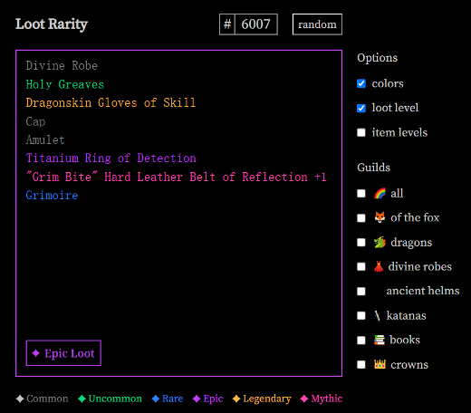

# Color Loot

## Color Loot 是什么？

Loot 在社区、工具和相关衍生项目的共同促进下，使其生态得以蓬勃发展。Loot 社区也在提供令人兴奋的生态工具，其中重要的一个就是 Loot 的稀有度。

Color Loot 旨在为 Loot 社区提供 Loot 链上稀有度数据，开发者可以从 Color Loot 合约中访问 Loot 稀有度，并与 Loot 的 token ID 相同。

对于每个 Loot 代币，我们都会创建相应的 Color Loot 代币。当 Color Loot 的总供应量与 Loot 相等时（目前为 7,779），Color Loot 将返回 Loot 的确切稀有度。稀有度数据将在新的 Color Loot 铸造时改变。

Color Loot 的总供应量为 8,000 枚。您可以随意以任何您想要的方式使用它。

## Color Loot 稀有度数据有什么价值？

有很多很棒的项目为 Loot 稀有度提供了链外工具，例如Chrome插件，SVG增强，JS SDK，用户和开发者可以使用它们来检查战利品的稀有度，并在SVG中为每种稀有度显示不同的颜色，其中 [loot-rarity](https://github.com/bpierre/loot-rarity) 作为loot的链外工具，提供了一套被Loot生态广泛认可的稀有度的计算方法。分为六级：Common Loot（普通）, Uncommon（不普通）, Rare（稀有）, Epic（史诗）, Legendary（传奇）, Mythic（神话）。

Color Loot 基于 loot-rarity 的分类方法，自动计算链上装备稀有度，并随着 mint 进度，最终会根据装备稀有度来显示颜色。更为重要的是，Color Loot 提供稀有度接口，其它合约可在链上访问 Loot 装备稀有度，这是原生 Loot 合约所没有的功能。

典型的应用场景：合约开发者可基于 Color Loot 开发应用，比如根据 ID 获取原生 Loot 装备稀有度，计算战斗力；也可以开发基于原生 Loot 的挖矿合约，比如根据 Loot 的稀有度计算挖矿的速度。

## 发行方式

无官方预留，全部作品公平发行。

## 关注我们

Twitter

Discord

## Color Loot展示

根据稀有度的计算方法，所形成的Color Loot展示如下：

其中：
* 灰色：Common（普通）
* 绿色：Uncommon（不普通）
* 蓝色：Rare（稀有）
* 紫色：Epic（史诗）
* 黄色：Legendary（传奇）
* 粉色：Mythic（神话）
